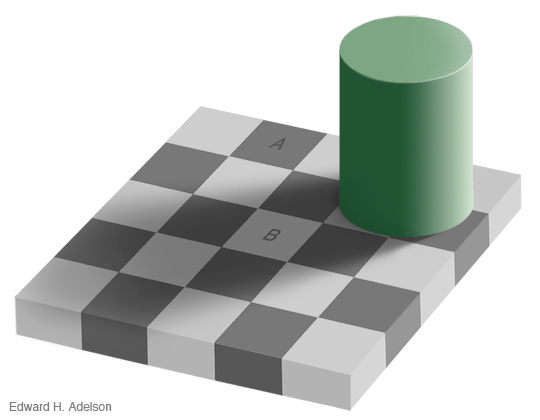

#Смысл - это иллюзия

Это перевод. Оригинал: [https://danielmiessler.com/blog/meaning-is-an-illusion/](https://danielmiessler.com/blog/meaning-is-an-illusion/)

**Поля Α и B - одного и того же цвета**

Скорее всего это самая важное, что я когда-либо писал, т.к. я считаю, что нашёл ни что иное, как смысл жизни,  или его отсутствие. Если вы умны/образованны, начало этого эссе может показаться вам достаточно обычным. Тем не менее следите за мыслью.

## Основной аргумент

**Смысл << Эмоция << Химия << Физика**

"Смысл" жизни исходит исключительно из эмоционального опыта, который базируется на химии. Мы знаем, что эмоция, и даже духовный опыт, по своей природе химические события. В наше время с помощью науки возможно, используя препараты и/или прямые манипуляции с мозгом индуцировать "духовный" опыт.

Конечно, возможно, что эти изменения просто делают нас восприимчивыми к сигналам из настоящего мира духов, но я нахоже эту возможность достаточно достаточно незначительной, чтобы отбросить её с небольшим обсуждением. Точно так же я исключаю возможность того, что "демон пола" использовал телекинез, чтобы затащить чашку кофе в свои недра, когда я случайно выпустил её из рук и она упала на землю. Короче, когда есть прозрачное, научное объяснение для чего-либо [мало причин покупаться на что-то ещё](https://ru.wikipedia.org/wiki/%D0%91%D1%80%D0%B8%D1%82%D0%B2%D0%B0_%D0%9E%D0%BA%D0%BA%D0%B0%D0%BC%D0%B0), что требует сверхестественного.

Я утверждаю, что все цели и стремления, как бы высоки или "самоотверженны" они ни были, являются не более, чем одинаково равными иллюзиями, основанными на биологии, которая основана на химии, которая основана на физике. 

Вкратце, смысл выдуман людьми как объяснение почему мы делаем то, что мы делаем. Мы строим эту иллюзию, потому что альтернатива слишком невыносима.

## Цели

Все мои цели, и цели всех, кого я когда либо встречал лично или через extended experience, основаны на эмоциях. Взять, например, меня, поскольку я могу говорить о себе авторитетно. Откровеннейше говоря, вот основные вещи, которые я желаю в жизни (не обязательно именно в таком порядке):

*   Чувствовать контроль на своей жизнью и судьбой
*   Быть уважаемым теми, кто вокруг меня, на работе и вне её
*   Любить одну женщину, но быть искомым другими 
*   Быть достаточно образованным и мудрым, чтобы понимать мир
*   Использовать вышеуказанное знание, чтобы помогать улучшать жизни других
*   Делится опытом прекрасного с умными, интересными людьми 

Сначала идут достаточно стандартные цели, и большинство так или иначе будут согласны с ними. Далее идут те цели, которые признаются как более "высшие", и ими заняты те, кто по своей природе более самоотвержен.

Но они не таковы.

Все мы слышали о том, что концепция альтруизма эгоистична, потому что она приносит удовольствие дающему. Ну, это модель, объясняющая это наблюдение. Желание помогать другим, так же как желание быть могущественным вполне естественно и основанно на эмоциях. В обоих случая результат - это химический впрыск удовольствия в мозг того, кто достигает своей цели.

Единственное различие между эгоистичными и альтруистичными желаниями в том, позитивен ли результат желания для других _в дополнение к вам_, или не позитивен он для вас вообще. Желания существуют **всегда** для вас самих. Даже когда вы отчаянно хотите пожертвовать собой ради кого-то, кого вы любите, вы всё равно делаете это, потому что _не сделав это_ вы обрекаете себя на ещё большее страдание. Это не самотверженный акт; это результат того, что вы вынуждены к совершению действия, так же как вы вынуждены искать пищу, дом или пару.

У животных так же есть желания. Они желают контроллировать свою территорию или убивать конкурентов, спариваться, разможаться и пр. Многие животные даже любят мастурбировать, и оплакивать потерю любимых. На самом деле наши желания не сильно отличаются от желаний животных; мы просто надули себя поверив что они другие через сложный самообман.

К пример, идите и спросить обычного родителя, почему он или она завёл детей, Вы получите такой же ответ как если бы вы спросили обезьяну почему она бросила в кого-то какашкой. "Эм, потому что так _принято_?". А если вам повезёт и вы наткнётесь на "возвышенного" мыслителя, он(а) ответит, что дети дают им сильное чувство выполненного долга, или даже, что это даёт им возможность жить после смерти. В любом случае всё только для выгоды родителя.

Но если вы подумаете об это, других вариантов просто нет. Нерождённых детей мало волнует тот факт, что они не были рождены. Люди заводят детей для себя, а не для своих нерождённых детей. Люди заводят детей, потому что химия говорит им делать это, что проявляется в виде эмоции, "Я просто хочу детей...". Ну, конечно, ты их хочешь.

И мы называем это нашей индивидуальностью?

## Возвышенные и низменные цели

Теперь давайте будем откровенны. Я считаю, что все человеческие цели, являются ли они базовыми и откровенно эгоистичными(иметь достаточно денег, чтобы заниматься сексом тогда, когда хочется), и цели высшего порядка, такие как(Я хочу помочь Африке, даже если это разрушит мою карьеру...) - принципиально одинаковы. Они все химические обоснованы и предлагают химические награды.

Желания 45-тилетнего бухгалтера с оплаченным кредитом за дом, красивой женой, двумя детьми и здоровым счётом в банке на сумму 401-на тысяча долларов ничем не отличаются от желаний 17-тилетнего наркодилера, живущего с родителями и пытающегося вернуть свою бывшую.

Давайте оценим эти желания:

**Банкир**

* Быть хорошим отцом
* Быть уважемым дома и на работе
* Сделать свою жену счастливой
* Получить следующее повышение
* Держать плохих ребят подальше от своей семьи (голосует за республиканцев)
* Отправить своих детей в хорошие коледжи
* Купить наконец этот летний домик

**Наркодилер**

* Сделать достаточно денег, чтобы купить собственный угол
* Раздобыть тачку получше, чтобы произвести впечатление на свою бывшую
* Достать пушку, чтобы люди знали, что со мной не шутят
* Добыть шмотки получше 
* Больше ходить в качалку, чтобы быть более привлекательным/угрожающим

Окей, а теперь настоящее веселье. Давайте посмотрим на суслика(ага, настоящего суслика):

**Суслик**

* Добыть больше палочек для лучшего домика
* Найти больше еды
* Привлечь вон ту самочку
* Защищать детёнышей
* Добыть больше палочек для...

Теперь буддийский монах.

**Монах**

* Отбросить бысмысленные привязанности к материальному
* Научиться отпускать самосознани
* Сконцентриваться на текущем моменте, не до, не после него

Что все эти вещи имеют общего? Все они приводят к одному и тому же при их достижении.

_К впрыску._

Это звук приятной химии поступающей в ваш мозг. Химия почти одинакова для банкира, наркодилера и монаха. Она обратывается почти одинаковой начинкой в мозгу. Впрыск - это источник счастья.

Всё остальное, например духовность, смысл, предназначение и пр. добавляется после этого. В жизни животных нет смысла, потому что они не достаточно сложны, чтобы создать его, как объяснение для того, что они делают. А мы сложны достаточно, поэтому он у нас есть.

Я писал ранее о том, что [я считаю, что свободы воли не существует](https://danielmiessler.com/writing/free_will_delusion/ "danielmiessler.com | writing | Free Will: The Necessary Delusion"). Интересно, что концепции "смысла" и "свободы воли" идентичны в одном ключевом смысле: оба они не существуют, но мы отчаянно нуждаемся в них, чтобы поддерживать здоровое общество.

## Так что же делать с этим знанием?

Как только вы пробудились, и осознаёте, что все ваши желания и удовольствия в конце концов сводятся к химическим взаимодействиям, есть несколько путей, по которым вы можете пойти.

1. Осознать как это тягостно, тут же выбросить это из головы и продолжить притворяться, что смысл настоящий. По существу, снова заснуть.
1. Осознать насколько центральную позицию занимают эмоции и отринуть все "возвышенные" стремления. Посвятить свою жизнь стремлению к удовольствию, т.к. это в любом случае единственный источник смысла.
1. Поддерживать двойную осознанность. Осознать, что это иллюзия, но участвовать в ней для собственного здравомыслия. Следовать жизненному пути, который позволяет большему количеству людей пережить счастье и меньшему страдание.

Я выбрал третье. Я выбрал осмысленно, как если бы у меня была свобода воли, признавая, что её не существует, но оперируя так как будто она есть, потому что нет другой практической альтернативы учитывая мои ограничения как человека(или общества).

Тут на поверхность всплывает интересный вопрос: как много других непробуждённых людей просто выбрали первый вариант?

## Выводы

Самое поразительное осознание приходящее с этим знанием - это то, что невежды и запутавшиеся в жизни люди принципиально ничем не отличаются от меня. Факт пробуждения не отменяет факта, что я черпаю смысл из химии. Поэтому когда я в лифте, заполненном христианами, поддерживающими Буша, и я смотрю на них сверху вниз за их глупость, я по большому счёту ничем не отличаюсь от них.

Да, я осознаю свои ограничения, но это не их не удаляет. Я получил удовольствие от осознания того, что я круче, так? Типа того, что я в курсе секрета, которого они не понимают. Ну, и чем это отличается от получения удовольствия в церкви по воскресеньям? Или от съедения хорошей тарелки мороженного. Нет никакой разницы.

Впрыск есть впрыск. Всё это - одно и то же.

Я могу сказать вам, что это осознание дало мне другой взгляд на религиозных людей. Религия и духовность - это предельное проявление иллюзии, потому что религиозные люди создают альтернативные миры, из которых происходит смысл. И снова, интересно как много из них так поступают, потому что смотрели сквозь иллюзию, но это было слишком для них.

Ещё один интересный пункт в том, что быть недуховным атеистом, который верит во внутреннюю мотивацию ещё более абсурдно, чем быть религиозным. По крайней мере у религиозного человека есть поддержка его утверждений - даже если она ложна; атеист верящий во внутреннюю мотивацию такой поддержки не имеет. Единственные атеисты, у которых есть твёрдая почва под ногами в рамках смысла - это те, кто создают его в контексте иллюзии.

Когда генеральный директор заходит к нам в лифт, а потом монах на следующем этаже, в наших головах происходят вещи одного и того же сорта. Скажу, что монах глуп, потому что отринул слишком много того, что доставляет удовльствие в материальном мир. Директор думает, что мы глупы, потому что у нас нет двух загородных домов и яхты. А христианине смотрят на нас сверху вних, потому что знают, что Иисус - это ответ.

Мы все подписались под нашими маленькими фантазиями, и все они приводят к впрыскам удовольствия. Нам нравится знать, что мы часть небольшой группы, которая "в теме".

И всё же, скажу, что я лучше, потому что я знаю, что ничто из этого не реально, что ведёт к следующему пункту.

## Заключение

Есть два типа людей: те, кто знают, что участвуют в иллюзии, и те кто всё ещё верит во внутреннюю мотивацию. Есть две принципиальные классификации существ. Животные и 99% людей с одной стороны, и осознающие люди с другой.

Ответ на вопрос "почему?" прост: мы - химические машины, движимые эволюцией. Мы желаем власти, привлекательности и счастья только, потому что те кто их достигает успешны в распространении самих себя. Возможно, смысл сам по себе - это мем, используемый эволюцией, чтобы уговорить нас выполнять её приказы. Её метод сокрытия скучности повседневной жизни. Смысл - необходимая иллюзия.

Вопрос не в том, можете ли вы сбросить ваши мирские, эгоистические желания. Вы не можете. Не важно каковы ваши желания, вне зависимости от того, как они самоотвержены, их исполнение всё равно ведёт к счастью для вас. Это природа живого существа, и это то, что делает их _вашими_ желаниями. Настоящий вопрос в том, сможете ли вы эволюционировать ваши цели к том, чтобы быть полезными для других в то же время удовлетворяя вас самих.

Это мораль нового мира осознанности. Увеличивать счастье и уменьшать страдания не что-то, что нужно делать для другого мира; это что-то, что нужно делать просто, потому что мы знаем, что это за чувства, и мы должны пытаться сделать других счастливыми так же, как мы сами хотели бы этого.

Так же это и определение продвинутого общества. Продвинутое общество работает изнутри иллюзии и стремится достичь связи между счастьем и страданием мира. Другими словами, когда один человек страдает мир страдает, и когда люди счастливы мир счастлив.

Осознание иллюзии также делает концепцию виртуальных миров немного интереснее. Как только вы учитываете иллюзию, становится гораздо менее странным искать удовольствия в альтернативных мирах фантазии. Эти другие миры в конце концов дают нам ту же самую вещь, которую мы получаем от "реального" мира, собственно впрыск. Какая в сущности разница откуда он приходит?

В общем, я не вижу это осознание полностью унылым, что я уверен будет главной причиной для жалоб(и в результате причиной отрицания этого осознания). Но вместе того, чтобы видеть в этом свидетельство полного отсутствия смысл в ваших жизнях, давайте делать различие между внутренней мотивацией и мотивацией, которую мы можем создать сами. Давайте использовать это осознание для создания нашего собственного смысла.

